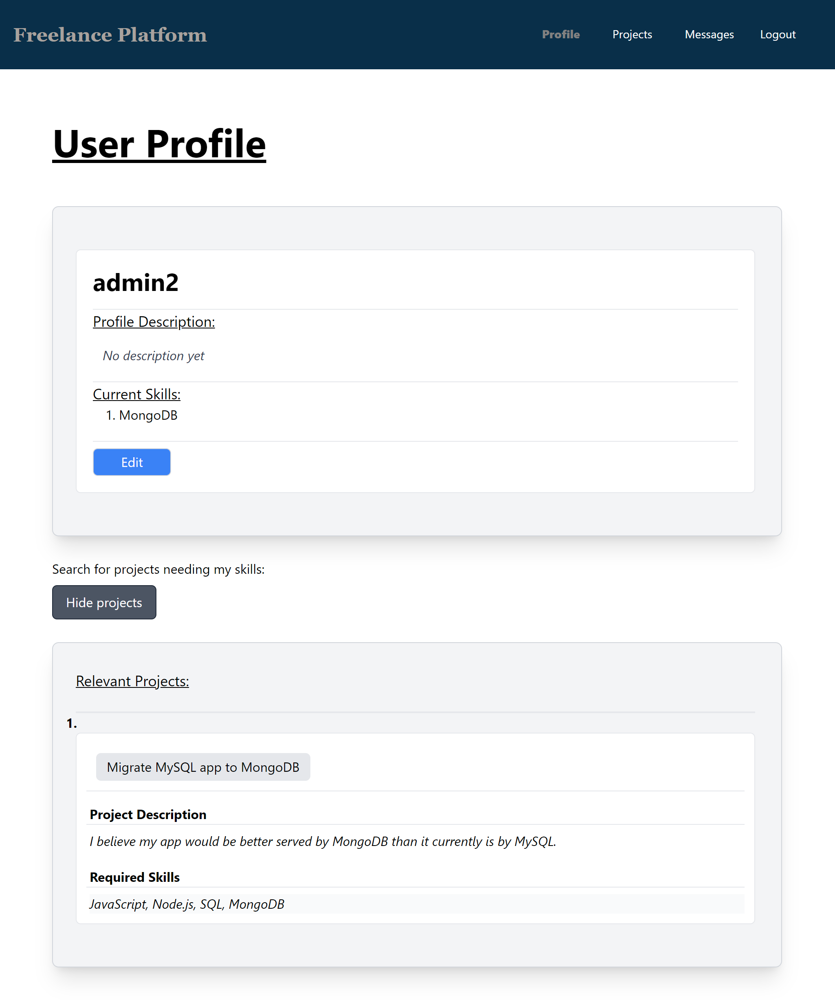
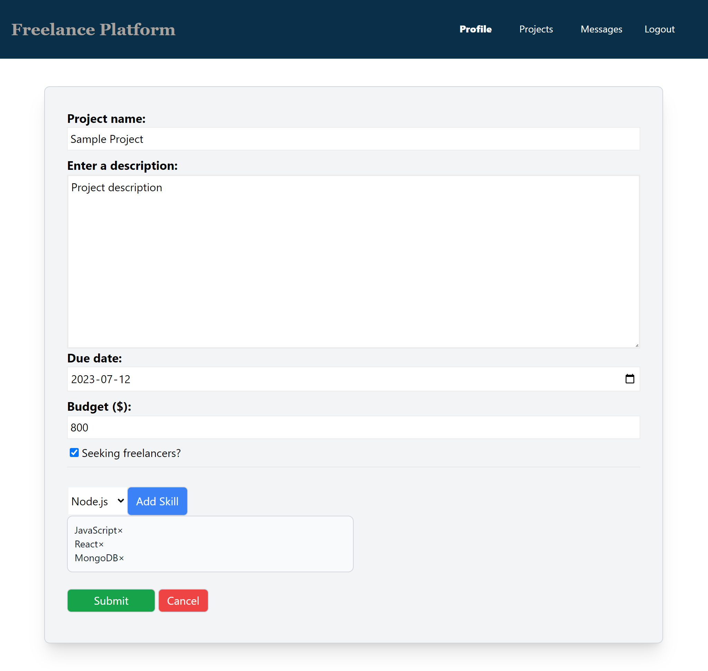
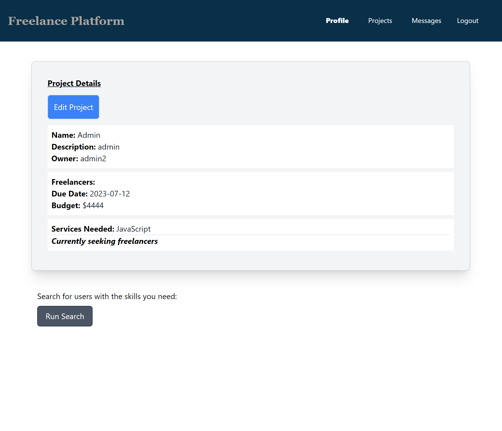
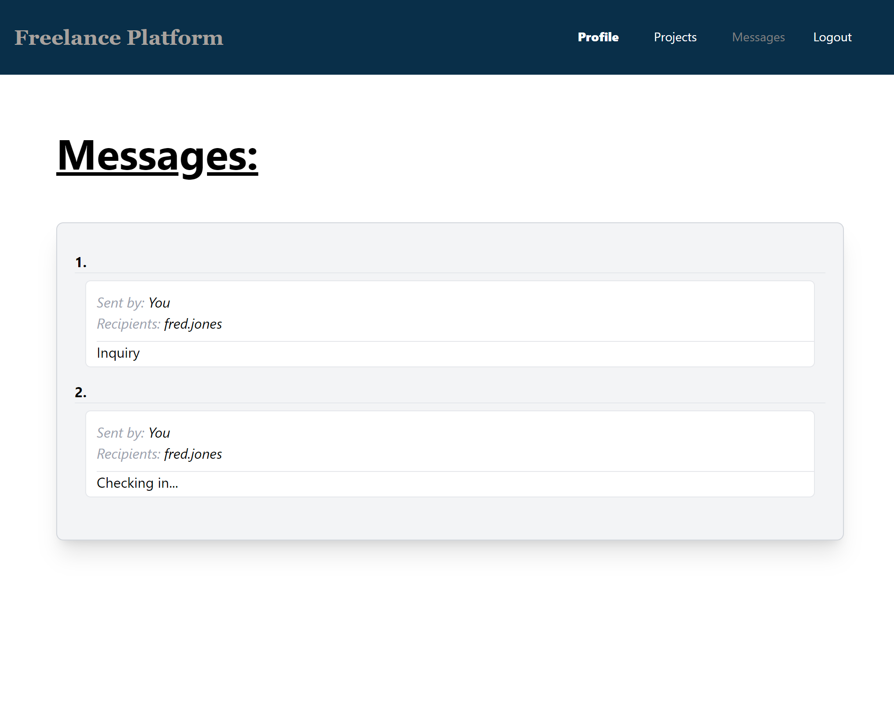
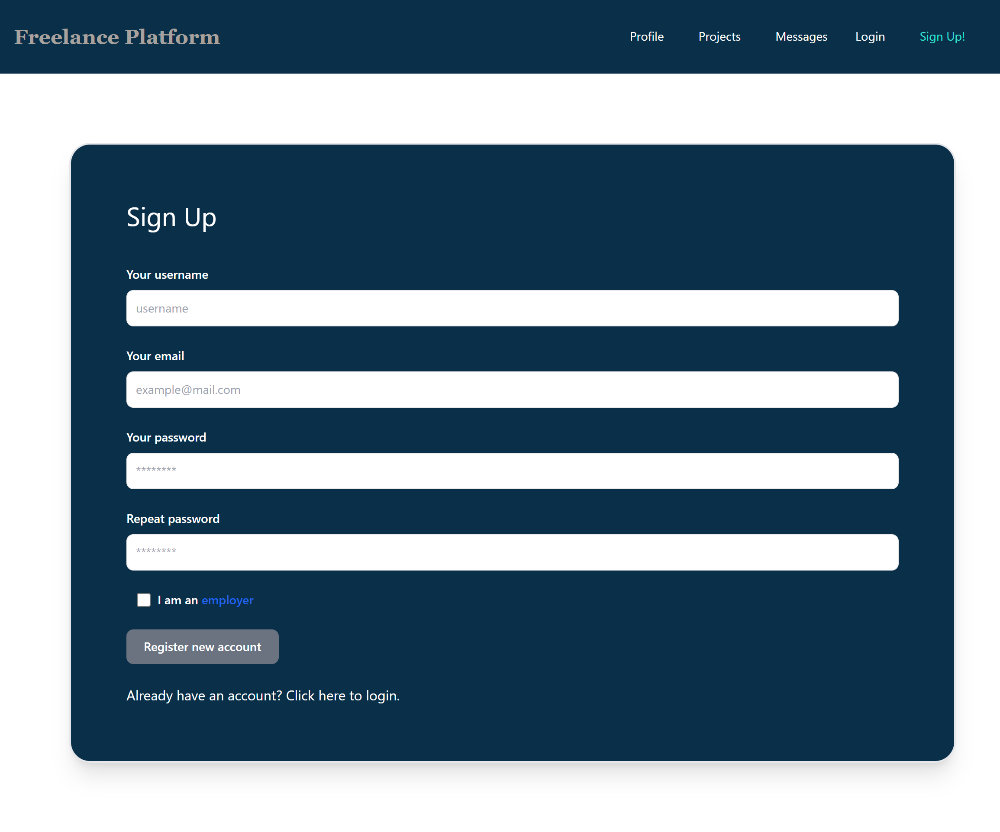

# Freelance Platform

<!--  -->

 

## Description

The freelance platform is a web application that connects freelancers with clients looking for their services. It provides a platform where freelancers can showcase their skills and expertise, and clients can post projects they need assistance with.

 

## Table of Contents

- [Description](#description)
- [Table of Contents](#table-of-contents)
- [Usage](#usage)
- [Deployed Webpage](#deployed-webpage)
- [Technology](#technology)
- [Installation](#installation)
- [License](#license)
- [Contributors](#contributors)

 

## Usage
You need to be create an account and be logged in to use the app (links are on the navbar).  On the profile page, you (as a freelancer) can enter information you wish employers to see, including a list of skills you wish to market.  You can also perform a search for projects that match your skills.  On the projects page, you can create projects to find help with, and enter skills/services that you are seeking.  Similarly, you can also search for freelancers with the skills you need.  When viewing someone else's profile or project, you can choose to send them a message (in app).  On the messages page, you can view all messages you have sent and received, and reply to the latter.

### Profile Page

### Project Page

### Messages Page

### SignUp Page

 

## Deployed Webpage

[View it live on Heroku](https://freelance-platform-5f9607a54217.herokuapp.com)

 

## Technology

The application utilizes a range of technogies to delivere its functionality. These include:

- Back-End Technologies:

  - Node.js: JavaScript runtime
  - Express: web application framework for Node.js

- Front-End Technologies:

  - React
  - TailwindCSS: enhance the visual appearance and layout of the application

- Database:

  - MongoDB: handle and store data

 

## Additional Features to Consider

Here are some additional features to consider or implement in the future. These include:

1. Implement Advanced Search and Filtering
2. Integrate Real-time Communication
3. Offer Project Management Tools
4. Implement payment integration

 

## Installation

- git clone - https://github.com/s2robertson/freelance-platform.git
- Set up .env variables 
  - `JWT_SECRET` is used for logging users in, and can hold any value
  - `MONGODB_URI` is used to connect to your database, or you can use the default of `mongodb://127.0.0.1:27017/freelance_db`
- npm install
- either `npm run dev` for development mode, or `npm run build` and `npm start` for production

 

## License

Please refer to the [LICENSE](License doc) document.

 

## Contributors

[Steven Robertson](https://github.com/s2robertson), [Zain Gova](https://github.com/zaingova), [Saveetha Kathiravan](https://github.com/saveetha17)
